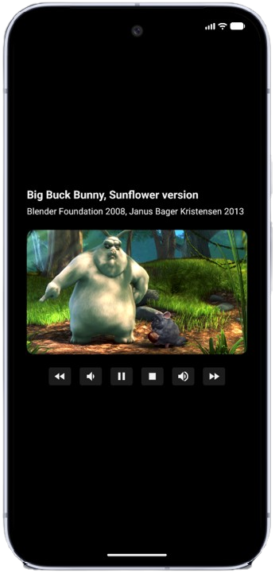

<p align="center">
  
</p>

<h1 align="center">LibVLC Player for Expo</h1>

<p align="center">
  <a href="https://www.npmjs.com/package/expo-libvlc-player" target="_blank">
    
  </a>
</p>

<p align="center">
  
</p>

## Supported versions

| Platform             | Version |
| -------------------- | ------- |
| Expo SDK             | 57+     |
| React Native         | 0.86+   |
| Android / Android TV | 7+      |
| iOS / Apple TV       | 16.4+   |

### Can I use this library with older Expo SDK versions?

Previous versions may be supported by changing how you compile the app.

#### Example app.json for older SDKs

```json
{
  "expo": {
    "plugins": [
      [
        "expo-build-properties",
        {
          "android": {
            "compileSdkVersion": 36,
            "targetSdkVersion": 36,
            "buildToolsVersion": "36.0.0"
          },
          "ios": {
            "deploymentTarget": "16.4"
          }
        }
      ]
    ]
  }
}
```

## Installation

```sh
npm install expo-libvlc-player
```

### Bare React Native projects

For bare React Native projects, you must ensure that you have [installed and configured](https://docs.expo.dev/bare/installing-expo-modules/) the `expo` package.

### Configure for Android

No additional configuration necessary.

### Configure for iOS

Run `npx pod-install` after installing the npm package.

### Configure for TV

Set the `EXPO_TV` environment variable, and run prebuild to make the TV modifications to the project.

```sh
EXPO_TV=1 npx expo prebuild
```

### Configuration in app config

You can configure `expo-libvlc-player` using its built-in config plugin if you use config plugins in your project.

#### Example app.json with config plugin

```json
{
  "expo": {
    "plugins": [
      [
        "expo-libvlc-player",
        {
          "localNetworkPermission": "Allow $(PRODUCT_NAME) to access your local network",
          "supportsPictureInPicture": true
        }
      ]
    ]
  }
}
```

#### Configurable properties

| Name                       | Description                                                                                                                                                                                                                                                                                                         | Default                                                |
| -------------------------- | ------------------------------------------------------------------------------------------------------------------------------------------------------------------------------------------------------------------------------------------------------------------------------------------------------------------- | ------------------------------------------------------ |
| `localNetworkPermission`   | A string to set the `NSLocalNetworkUsageDescription` permission message on iOS                                                                                                                                                                                                                                      | `"Allow $(PRODUCT_NAME) to access your local network"` |
| `supportsPictureInPicture` | A boolean to enable Picture-in-Picture (PiP) support. If `true`, it adds the `android:supportsPictureInPicture` attribute on Android and the `audio` mode to the `UIBackgroundModes` on iOS. If `false`, it removes the attribute on Android and the mode on iOS. If `undefined`, the configuration is not modified | `undefined`                                            |

## Usage

Create a basic player:

```tsx
import { LibVlcPlayerView } from "expo-libvlc-player";

return <LibVlcPlayerView source={require("./assets/bbb.mp4")} />;
```

Trigger the local network privacy alert on iOS:

```tsx
import LibVlcPlayerModule from "expo-libvlc-player";

await LibVlcPlayerModule.triggerNetworkAlert();
```

Check for Picture-in-Picture (PiP) support:

```tsx
import LibVlcPlayerModule from "expo-libvlc-player";

LibVlcPlayerModule.isPictureInPictureSupported();
```

See the [Example App](example) for additional usage.

### Module functions

The `LibVlcPlayerModule` implements the following functions:

| Function                        | Description                                                 | Returns         |
| ------------------------------- | ----------------------------------------------------------- | --------------- |
| `triggerNetworkAlert()`         | Attempts to trigger the local network privacy alert on iOS  | `Promise<void>` |
| `isPictureInPictureSupported()` | Checks whether the device supports Picture-in-Picture (PiP) | `boolean`       |

### View functions

The `LibVlcPlayerViewRef` implements the following functions:

| Function                  | Parameters                                                                                                                        | Description                                                                              | Returns         |
| ------------------------- | --------------------------------------------------------------------------------------------------------------------------------- | ---------------------------------------------------------------------------------------- | --------------- |
| `play()`                  |                                                                                                                                   | Starts playback of the current player                                                    | `Promise<void>` |
| `pause()`                 |                                                                                                                                   | Pauses playback of the current player                                                    | `Promise<void>` |
| `stop()`                  |                                                                                                                                   | Stops playback of the current player                                                     | `Promise<void>` |
| `seek()`                  | `value: number` — Must be `0` or greater<br>`type: "time" \| "position"` — Defaults to time                                       | Sets the time or position of the current player                                          | `Promise<void>` |
| `record()`                | `path?: string` — Must be a valid directory, or `undefined` to stop recording                                                     | Starts or stops recording the current media                                              | `Promise<void>` |
| `snapshot()`              | `path: string` — Must be a valid directory                                                                                        | Takes a snapshot of the current media                                                    | `Promise<void>` |
| `postAction()`            | `action: 1 \| 2` — Which dialog action to perform                                                                                 | Posts an answer to a question dialog                                                     | `Promise<void>` |
| `postLogin()`             | `username: string` — Can't be empty<br>`password?: string` — Can be empty<br>`store?: boolean` — Whether to store the credentials | Posts a username and password to a login dialog                                          | `Promise<void>` |
| `dismiss()`               |                                                                                                                                   | Dismisses the current dialog                                                             | `Promise<void>` |
| `startPictureInPicture()` |                                                                                                                                   | Enters Picture-in-Picture (PiP) mode. Config plugin has to be configured for PiP to work | `Promise<void>` |
| `stopPictureInPicture()`  |                                                                                                                                   | Exits Picture-in-Picture (PiP) mode on iOS                                               | `Promise<void>` |

### View props

The `LibVlcPlayerView` extends React Native `ViewProps` and implements the following props:

| Prop               | Description                                                                                                                       | Default     |
| ------------------ | --------------------------------------------------------------------------------------------------------------------------------- | ----------- |
| `source`           | Sets the source of the media to be played, or `null` to release the player. See [`LibVlcSource`](#libvlcsource) for more          |             |
| `options`          | Sets the options to initialize the media with. See the [VideoLAN Wiki](https://wiki.videolan.org/VLC_command-line_help/) for more | `[]`        |
| `slaves`           | Sets the player audio and subtitle slaves. See [`Slave`](#slave) for more                                                         | `[]`        |
| `tracks`           | Sets the player audio, video, and subtitle track indexes. See [`Tracks`](#tracks) for more                                        | `undefined` |
| `delays`           | Sets the player audio and subtitle delay values in microseconds. See [`Delays`](#delays) for more                                 | `undefined` |
| `scale`            | Sets the player scaling factor                                                                                                    | `0`         |
| `aspectRatio`      | Sets the container aspect ratio. When set to auto, a fallback ratio is required                                                   | `undefined` |
| `fallbackRatio`    | Sets the fallback aspect ratio                                                                                                    | `undefined` |
| `contentFit`       | Sets how the video should be scaled to fit in the container                                                                       | `"contain"` |
| `rate`             | Sets the player playback rate                                                                                                     | `1`         |
| `time`             | Sets the initial player time in milliseconds. Must be `0` or greater                                                              | `0`         |
| `volume`           | Sets the player volume. Must be between `0` and `100`                                                                             | `100`       |
| `mute`             | Sets the player volume to `0` when `true` and restores previous volume when `false`                                               | `false`     |
| `audioMixingMode`  | Determines how the player will interact with other audio in the system                                                            | `"auto"`    |
| `repeat`           | Determines whether the media should repeat once ended                                                                             | `false`     |
| `autoplay`         | Determines whether the media should autoplay once created                                                                         | `true`      |
| `pictureInPicture` | Determines whether the player should allow Picture-in-Picture (PiP) mode                                                          | `false`     |

#### Callback props

| Prop                      | Description                                                  | Payload                       |
| ------------------------- | ------------------------------------------------------------ | ----------------------------- |
| `onBuffering`             | Called after the `Buffering` player event                    | [`Buffering`](#buffering)     |
| `onPlaying`               | Called after the `Playing` player event                      |                               |
| `onPaused`                | Called after the `Paused` player event                       |                               |
| `onStopped`               | Called after the `Stopped` player event                      |                               |
| `onEncounteredError`      | Called after the `EncounteredError` player event             | [`Error`](#error)             |
| `onDialogDisplay`         | Called after a dialog needs to be displayed                  | [`Dialog`](#dialog)           |
| `onTimeChanged`           | Called after the `TimeChanged` player event                  | [`Time`](#time)               |
| `onPositionChanged`       | Called after the `PositionChanged` player event              | [`Position`](#position)       |
| `onESAdded`               | Called after the `ESAdded` player event                      | [`MediaTracks`](#mediatracks) |
| `onRecordChanged`         | Called after the `RecordChanged` player event                | [`Recording`](#recording)     |
| `onSnapshotTaken`         | Called after a media snapshot is taken                       | [`Snapshot`](#snapshot)       |
| `onFirstPlay`             | Called after the player first playing event                  | [`MediaInfo`](#mediainfo)     |
| `onForeground`            | Called after the player enters the foreground                |                               |
| `onBackground`            | Called after the player enters the background                |                               |
| `onPictureInPictureStart` | Called after the player enters Picture-in-Picture (PiP) mode |                               |
| `onPictureInPictureStop`  | Called after the player exits Picture-in-Picture (PiP) mode  |                               |

### Module types

#### `LibVlcSource`

```ts
type LibVlcSource = string | number | null;
```

#### `Slave`

```ts
interface Slave {
  source: string | number;
  type: "audio" | "subtitle";
  selected?: boolean;
}
```

#### `Tracks`

```ts
interface Tracks {
  audio?: number;
  video?: number;
  subtitle?: number;
}
```

#### `Delays`

```ts
interface Delays {
  audio?: number;
  subtitle?: number;
}
```

#### `Buffering`

```ts
interface Buffering {
  value: number;
}
```

#### `Error`

```ts
interface Error {
  message: string;
}
```

#### `Dialog`

```ts
interface Dialog {
  title: string;
  text: string;
  type: "error" | "login" | "question";
  cancelText: string | null;
  action1Text: string | null;
  action2Text: string | null;
}
```

#### `Time`

```ts
interface Time {
  value: number;
}
```

#### `Position`

```ts
interface Position {
  value: number;
}
```

#### `MediaTrack`

```ts
interface MediaTrack {
  id: number;
  name: string;
}
```

#### `MediaTracks`

```ts
interface MediaTracks {
  audio: MediaTrack[];
  video: MediaTrack[];
  subtitle: MediaTrack[];
}
```

#### `Recording`

```ts
interface Recording {
  path: string | null;
  isRecording: boolean;
}
```

#### `Snapshot`

```ts
interface Snapshot {
  path: string;
}
```

#### `VideoInfo`

```ts
interface VideoInfo {
  width: number;
  height: number;
  frameRate: number;
  bitrate: number;
}
```

#### `MediaMetadata`

```ts
interface MediaMetadata {
  title: string | null;
  artist: string | null;
  album: string | null;
  artworkURL: string | null;
}
```

#### `MediaInfo`

```ts
interface MediaInfo {
  video: VideoInfo;
  metadata: MediaMetadata;
  length: number;
  seekable: boolean;
}
```

## Known issues

#### Black screen

On Android, the `libvlcjni` player detaches from the View after switching screens.

The current workaround attaches the View back to the player but causes a brief black screen.

https://code.videolan.org/videolan/vlc-android/-/issues/1495

#### Local network

On iOS, the `VLCKit` player interacts with the local network to discover media servers by default.

A custom message can be provided for the `NSLocalNetworkUsageDescription` key in the Info.plist file.

https://code.videolan.org/videolan/vlc-ios/-/issues/893

## Contributing

Contributions are always welcome. Please raise any issues or fix them by creating a pull request.

## Development

Install [Ktlint](https://github.com/ktlint/ktlint) and [SwiftFormat](https://github.com/nicklockwood/swiftformat) for linting native code:

```sh
brew install ktlint swiftformat
```

LibVLC might not render properly on emulators or simulators. Please test on a real device.

## Disclaimer

This project is not affiliated with, endorsed by, or officially supported by VideoLAN. The VLC icon is trademark of VideoLAN and is used here solely to indicate compatibility with the following LibVLC bindings:

- `libvlcjni` for Android / Android TV
- `VLCKit` for iOS / Apple TV

For official VLC products and support, please visit [videolan.org](https://www.videolan.org/).

## Credits

This library is inspired by existing projects such as [react-native-vlc-media-player](https://github.com/razorRun/react-native-vlc-media-player) and [expo-video](https://docs.expo.dev/versions/latest/sdk/video/).

## License

Made available under the MIT license, as found in the [LICENSE](LICENSE) file.
