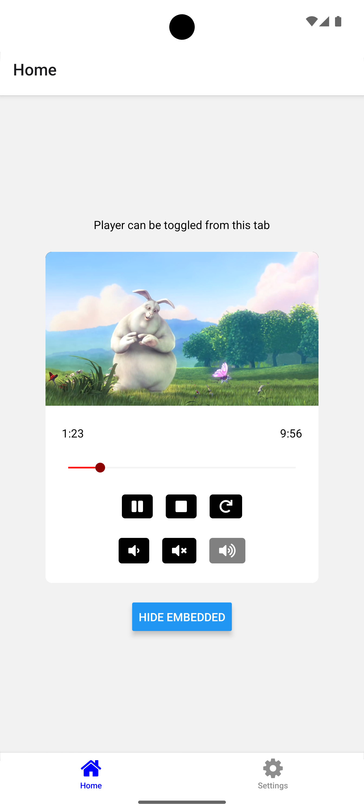

<p align="center">
  
</p>

<h1 align="center">LibVLC Player for Expo</h1>

<p align="center">
  <a href="https://www.npmjs.com/package/expo-libvlc-player" target="_blank">
    
  </a>
</p>

<p align="center">
  
  
</p>

<p align="center">
  <i>Screenshots taken from the <a href="example/App.tsx">Example App</a> on Android and iOS</i>
</p>

### Supported versions

| Platform             | Version |
| -------------------- | ------- |
| React Native         | 0.79    |
| Android / Android TV | 7+      |
| iOS / Apple TV       | 15.1+   |

### Installation

Add the package to your npm dependencies.

```
npm install expo-libvlc-player
```

### Bare React Native projects

For bare React Native projects, you must ensure that you have [installed and configured](https://docs.expo.dev/bare/installing-expo-modules/) the `expo` package.

### Configure for Android

No additional configuration necessary.

### Configure for iOS

Run `npx pod-install` after installing the npm package.

### Configure for TV

Set the `EXPO_TV` environment variable, and run prebuild to make the TV modifications to the project.

```
EXPO_TV=1 npx expo prebuild --clean
```

### Configuration in app config

You can configure `expo-libvlc-player` using its built-in config plugin if you use config plugins in your project.

#### Example app.json with config plugin

```json
{
  "expo": {
    "plugins": [
      [
        "expo-libvlc-player",
        {
          "localNetworkPermission": "Allow $(PRODUCT_NAME) to access your local network",
          "supportsBackgroundPlayback": true
        }
      ]
    ]
  }
}
```

#### Configurable properties

| Name                         | Description                                                                                                                                                                                                                  | Default                                                |
| ---------------------------- | ---------------------------------------------------------------------------------------------------------------------------------------------------------------------------------------------------------------------------- | ------------------------------------------------------ |
| `localNetworkPermission`     | A string to set the `NSLocalNetworkUsageDescription` permission message on iOS                                                                                                                                               | `"Allow $(PRODUCT_NAME) to access your local network"` |
| `supportsBackgroundPlayback` | A boolean value to enable background playback on iOS. If `true`, the `audio` key is added to the `UIBackgroundModes` array in the Info.plist file. If `false`, the key is removed. When `undefined`, the key is not modified | `undefined`                                            |

## Usage

```tsx
import { LibVlcPlayerView } from "expo-libvlc-player";

return (
  <View style={{ aspectRatio: 16 / 9 }}>
    <LibVlcPlayerView
      style={{ height: "100%" }}
      source="https://download.blender.org/peach/bigbuckbunny_movies/big_buck_bunny_720p_h264.mov"
    />
  </View>
);
```

Check whether battery optimization is enabled on Android:

```tsx
import LibVlcPlayerModule from "expo-libvlc-player";

await LibVlcPlayerModule.checkBatteryOptimization();
```

Trigger the local network privacy alert on iOS:

```tsx
import LibVlcPlayerModule from "expo-libvlc-player";

await LibVlcPlayerModule.triggerNetworkAlert();
```

See the [Example App](example/App.tsx) for additional usage.

### Module methods

| Method                       | Description                                                          | Returns            |
| ---------------------------- | -------------------------------------------------------------------- | ------------------ |
| `checkBatteryOptimization()` | Attempts to check whether battery optimization is enabled on Android | `Promise<boolean>` |
| `triggerNetworkAlert()`      | Attempts to trigger the local network privacy alert on iOS           | `Promise<void>`    |

### View methods

| Method                                             | Description                                                                                                            | Returns         |
| -------------------------------------------------- | ---------------------------------------------------------------------------------------------------------------------- | --------------- |
| `play()`                                           | Starts playback of the current player                                                                                  | `Promise<void>` |
| `pause()`                                          | Pauses playback of the current player                                                                                  | `Promise<void>` |
| `stop()`                                           | Stops playback of the current player                                                                                   | `Promise<void>` |
| `seek(value: number, type?: "time" \| "position")` | Sets the time or position of the current player. Must be a number equal or greater than `0`, type defaults to `"time"` | `Promise<void>` |
| `record(path?: string)`                            | Starts or stops recording the current media. Must be a valid string or `undefined` to stop recording                   | `Promise<void>` |
| `snapshot(path: string)`                           | Takes a snapshot of the current media. Must be a valid string                                                          | `Promise<void>` |
| `postAction(action: number)`                       | Posts an answer to a [`Dialog`](#dialog). Must be an integer of `1` or `2`                                             | `Promise<void>` |
| `dismiss()`                                        | Dismisses a [`Dialog`](#dialog)                                                                                        | `Promise<void>` |

### View props

The `LibVlcPlayerView` extends React Native `ViewProps` and implements the following:

| Prop               | Description                                                                                                                       | Default     |
| ------------------ | --------------------------------------------------------------------------------------------------------------------------------- | ----------- |
| `source`           | Sets the source of the media to be played. Set to `null` to release the player                                                    |             |
| `options`          | Sets the VLC options to initialize the player with. See the [VLC Wiki](https://wiki.videolan.org/VLC_command-line_help/) for more | `[]`        |
| `tracks`           | Sets the player audio, video and subtitle tracks object. See [`Tracks`](#tracks) for more                                         | `undefined` |
| `slaves`           | Sets the player audio and subtitle slaves array. See [`Slave`](#slave) for more                                                   | `[]`        |
| `scale`            | Sets the player scaling factor. Must be a float equal or greater than `0`                                                         | `0`         |
| `aspectRatio`      | Sets the player aspect ratio. Must be a valid string or `null` for default                                                        | `undefined` |
| `contentFit`       | Sets how the video should be scaled to fit in the container                                                                       | `"contain"` |
| `rate`             | Sets the player rate. Must be a float equal or greater than `1`                                                                   | `1`         |
| `time`             | Sets the initial player time. Must be an integer in milliseconds                                                                  | `0`         |
| `volume`           | Sets the player volume. Must be an integer between `0` and `100`                                                                  | `100`       |
| `mute`             | Sets the player volume to `0` when `true`. Previous value is set when `false`                                                     | `false`     |
| `audioMixingMode`  | Determines how the player will interact with other audio in the system                                                            | `"auto"`    |
| `playInBackground` | Determines whether the media should continue playing in the background. Battery optimization must be disabled on Android          | `false`     |
| `repeat`           | Determines whether the media should repeat once ended                                                                             | `false`     |
| `autoplay`         | Determines whether the media should autoplay once created                                                                         | `true`      |

#### Callbacks

| Prop                 | Description                                      | Payload                       |
| -------------------- | ------------------------------------------------ | ----------------------------- |
| `onBuffering`        | Called after the `Buffering` player event        |                               |
| `onPlaying`          | Called after the `Playing` player event          |                               |
| `onPaused`           | Called after the `Paused` player event           |                               |
| `onStopped`          | Called after the `Stopped` player event          |                               |
| `onEndReached`       | Called after the `EndReached` player event       |                               |
| `onEncounteredError` | Called after the `EncounteredError` player event | `{ error: string }`           |
| `onDialogDisplay`    | Called after a `Dialog` needs to be displayed    | [`Dialog`](#dialog)           |
| `onTimeChanged`      | Called after the `TimeChanged` player event      | `{ time: number }`            |
| `onPositionChanged`  | Called after the `PositionChanged` player event  | `{ position: number }`        |
| `onESAdded`          | Called after the `ESAdded` player event          | [`MediaTracks`](#mediatracks) |
| `onRecordChanged`    | Called after the `RecordChanged` player event    | [`Recording`](#recording)     |
| `onSnapshotTaken`    | Called after a media snapshot is taken           | `{ path: string }`            |
| `onFirstPlay`        | Called after the player first playing event      | [`MediaInfo`](#mediainfo)     |
| `onForeground`       | Called after the player enters the foreground    |                               |
| `onBackground`       | Called after the player enters the background    |                               |

### Types

#### `Tracks`

```ts
{
  audio?: number;
  video?: number;
  subtitle?: number;
}
```

#### `Slave`

```ts
{
  source: string | number;
  type: "audio" | "subtitle";
  selected?: boolean;
}
```

#### `Dialog`

```ts
{
  title: string;
  text: string;
  cancelText?: string;
  action1Text?: string;
  action2Text?: string;
}
```

#### `Recording`

```ts
{
  path: string | null;
  isRecording: boolean;
}
```

#### `Track`

```ts
{
  id: number;
  name: string;
}
```

#### `MediaTracks`

```ts
{
  audio: Track[];
  video: Track[];
  subtitle: Track[];
}
```

#### `MediaInfo`

```ts
{
  width: number;
  height: number;
  length: number;
  seekable: boolean;
  tracks: MediaTracks;
}
```

## Known issues

#### Black screen

On Android, the `libvlcjni` player detaches from the View when its surface is destroyed after switching screens.

The current workaround attaches the View once a surface is created but this causes a brief black screen.

https://code.videolan.org/videolan/vlc-android/-/issues/1495

#### Local network

On iOS, the `VLCKit` player seems to interact with the local network when playing media from external sources.

A clear message must be provided to the `NSLocalNetworkUsageDescription` key in the Info.plist file.

https://developer.apple.com/documentation/technotes/tn3179-understanding-local-network-privacy

#### Audio delay

On iOS, the `VLCKit` player experiences a small audio delay when resuming or muting media playback.

This might be related to the internal clock used by the library core causing inaccurate time values.

https://code.videolan.org/videolan/VLCKit/-/issues/233

## Disclaimer

This project is not affiliated with, endorsed by, or officially supported by VideoLAN. The VLC icon is trademark of VideoLAN and is used here solely to indicate compatibility with the following **LibVLC** bindings:

- `libvlcjni` for Android / Android TV
- `VLCKit` for iOS / Apple TV

For official VLC products and support, please visit [videolan.org](https://www.videolan.org/).

## Credits

This library is inspired by existing projects such as [expo-video](https://github.com/expo/expo/tree/main/packages/expo-video) and [react-native-vlc-media-player](https://github.com/razorRun/react-native-vlc-media-player).

## Contributing

Contributions are always welcome. Please raise any issues and/or fix them by creating a pull request.
